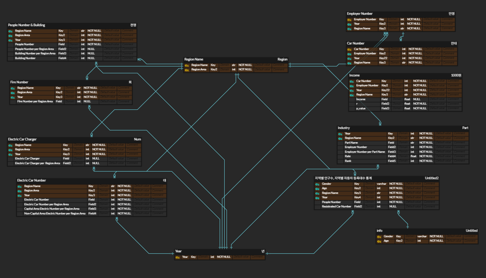

# 🚀 프로젝트명 (예: SKN18‑1st‑3Team)

> 팀명, 프로젝트명, 개발 기간, 슬로건 또는 한 줄 소개

---

## 📋 목차

1. 팀 소개  
2. 프로젝트 개요  
3. 기술 스택  
4. 시스템 구조 및 플로우  
5. 주요 기능  
6. 데이터 흐름 및 저장 방식  
7. UI 구성 (Streamlit 다중 페이지)  
8. ERD
9. UI(페이지) 구성

---

## 1. 팀 소개

## 👥 팀원 소개


| **박세영** | **김담하** | **김민주** | **이상효** | **임승옥** | **채린** |
|:--:|:--:|:--:|:--:|:--:|:--:|
|  |  |  |  |  |  |
| [@seyung000](https://github.com/seyung000) | [@DamHA-Kim](https://github.com/DamHA-Kim) | [@kmjj0801](https://github.com/kmjj0801) | [@lsh7159](https://github.com/lsh7159) | [@SeungOk00](https://github.com/SeungOk00) | [@cofls99](https://github.com/cofls99) |


---

## 2. 프로젝트 개요

### ✅ 프로젝트 목표  
  - 자동차 등록 수와 다양한 사회 지표간의 상관 관계 분석
  - 전기차 상용화 동향 예측
  - 기아 자동차 FAQ

---

## 3. 기술 스택

### ✔ 크롤링 (`faq.py`)
- 기아 고객 FAQ 웹 페이지에서 카테고리별 질문‑답변 전체 수집
- 페이지 처리 및 반복 데이터 수집 자동화  
- 결과를 csv 파일로 저장

### ✔ DB 저장 (`common/insert_db.py`)
- CSV 파일 기반 MySQL 테이블 생성 및 데이터 삽입

### ✔ UI 설계 (`pages/하부페이지`)
- FAQ 검색 + 카테고리 필터 기능  
- 사회 지표에 대한 분석 결과 출력
- 전기차 동향

---

## 6. 데이터 흐름 및 저장 방식

- selenium 및 beautifulsoup으로 웹페이지를 크롤링 작업
- 수집 데이터 저장 형태: CSV/XLSX (`kia_faq_data.csv` 등)  
- 이 데이터를 `insert_db.py`로 MySQL 테이블 `kia_faq`에 저장  
- 실시간 조회는 Streamlit이 DB로부터 직접 읽는 방식 또는 pandas CSV 로딩 방식  
- DB 접속 정보는 `.env` 파일에 저장 (host, port, user, password, db_name 등)

---

## 7. UI 구성 (Streamlit 다중 페이지)

```text
CHAP1/
├── assets/                  # 이미지, 로고 등 정적 리소스
│   ├── electric_car.png
│   └── skn_logo.png

├── common/                  # 공통 유틸 및 DB 초기화 코드
│   ├── .env                 # DB 환경 변수 파일
│   ├── create_db.sql        # DB 스키마 생성 쿼리
│   ├── insert_db.py         # CSV → MySQL 데이터 삽입 스크립트
│   └── utils.py             # DB 접속 및 기타 유틸 함수

├── data/
│   └── KIA_FAQ/            
│       ├── faq.py           # Selenium 기반 FAQ 크롤러
│       └── kia_faq_data.csv # 수집된 CSV 데이터

├── pages/                                  # Streamlit 다중 페이지 구성
│   ├── faq_page.py                          # 메인 FAQ 검색 UI
│   ├── 01. Region_Popul_Graph.py           # 지역별 인구-자동차 등록 상관계수
│   ├── 02. Employment_and_Industry.py      # 고용자수-산업 상관계수 페이지
│   ├── 03. Number_of_Registering_Car.py     # 차량 등록 수와 고용/소득/산업 간 상관관계 분석  
│   └── 04. Electric_Car_and_Infra.py    # 전기차 등록 및 인프라 분포 페이지

├── src/
│   └── crawling.py          # 기타 크롤러

├── app.py                   # Streamlit 첫 페이지
└── requirements.txt         # 설치 필요 패키지 목록

```

- `app.py`는 Streamlit `page_config` 기반으로 자동 페이지 라우팅  
- 각 페이지는 독립적으로 구성 가능 (검색, 시각화, 사용자 인터랙션 등)

---

## 8. ERD




---

## 9. UI(페이지) 구성

### 📄 Page 1: 전국 연도별 고용자 수 및 증가율

- **전국 고용자 수 추이**
  - 연도별 라인그래프
  - 고용자 수 및 증가율 표

- **지역별 고용자 수 변화**
  - 지역별 연도별 라인그래프 및 표

- **주 산업 분석 (3개년 평균)**
  - 지역별 산업 비중 원형 차트
  - 평균 고용자 수 및 비율 표

- **Top3 산업군 분석**
  - 지역별 대표 산업군 로드맵 + 원형 차트
  - 요약 표 (지역, 산업, 순위, 고용자 수)

---

### 📄 Page 2: 차량 등록수 vs 고용/소득/산업분포

- **고용자 수 vs 차량 등록 수**
  - 지역별 산점도 + 선형 회귀선
  - 상관계수 및 p-value 분석 표

- **지역 소득 vs 차량 등록 수**
  - 산점도 시각화 및 상관관계 분석

- **산업별 영향도**
  - 산업이 차량/고용자 수에 미치는 영향 계수 그래프 (coef + 에러바)

---

### 📄 Page 3: 전기차 인프라 및 화재 관련 데이터 시각화

### 🔹 Table 1: 인구수 & 건물 수 밀도

- Figure 1: 건물 수 → 히트맵 (히트값: 면적당 인구수)
- Figure 2: 인구 수 → 히트맵 (히트값: 면적당 건물 수)

### 🔹 Table 2: 전기차 등록 추이

- Figure 1: 지역별 면적당 전기차 수 → 막대그래프
- Figure 2: 2024년 월별 증가량 → 라인그래프

### 🔹 Table 3: 전기차 화재 변화

- Figure 1: 지역별 화재 발생 변화율 → 막대그래프

### 🔹 Table 4: 충전소 구축 현황

- Figure 1: 연도별 면적당 충전소 수 → 막대그래프


---

## 10. 회고 및 감사 인사

### 🙏 회고
- **박세영**: 데이터 분석 개념을 본격적으로 배우기 전에 인사이트를 뽑으려 하다 보니 어려운 점도 있었지만, 팀원 모두가 의욕적으로 참여해준 덕분에 다양한 방향으로 시도해볼 수 있었던 값진 경험이었습니다. 분석 과정에서 막히는 부분이 생길 때마다 함께 아이디어를 나누며 해결해나간 점이 특히 인상 깊었                고, 실습을 통해 데이터 기반 사고에 대한 이해도 한층 높아진 것 같습니다. 
- **김담하**: 하드캐리 감사합니다. 덕분에 어꺠너머로 많이 배워갔습니다.
- **김민주**: 배웠던 내용을 바탕으로 실제 프로젝트를 진행하면서 적용해볼 수 있어서 도움이 많이 되었습니다. 아울러 성공적으로 프로젝트를 마무리 하면서 팀원들과 적극적으로 소통하고 협력하는 것에 중요성을 느끼게 되었어요.
- **이상효**: LLM이 많이 발달한 것 같습니다 cursor 형님이 짱입니다.
- **임승옥**: 이번 프로젝트를 통해 지역별 고용, 소득, 산업 구조, 자동차 등록 현황 간의 관계를 직접 분석해보며, 단순한 데이터 수집을 넘어 데이터 구성부터 시각화까지 전 과정을 스스로 경험할 수 있었다. 의미 있는 결과를 얻기 위해선 데이터 프레임 구성뿐 아니라 ERD 설계가 정말 중요하다는 걸 체감했                 고, 특히 초반 설계 단계가 전체 흐름에 얼마나 큰 영향을 주는지도 배울 수 있었다. 실습에서 익힌 기술들을 실제 분석에 적용해보며, 데이터가 어떻게 인사이트로 이어지는지 한층 더 이해하게 되었다.
- **채린**: 이번 프로젝트를 통해 실제 데이터를 가지고 단순한 수치 비교를 넘어 조건별 상관관계를 정량적으로 분석하고 시각화하는 경험을 할 수 있었습니다.
            Streamlit을 활용한 대시보드 구현과 erd 설계 과정을 수행하면서 데이터 분석 결과를 누구나 직관적으로 접근하고 해석할 수 있는 형태로 전달하는 방법의 중요성을 다시 한번 느꼈습니다.
            비록 통계적으로 유의미한 상관관계는 발견되지 않았지만, 데이터 기반으로 문제를 정의하고 결과를 정제된 형태로 전달하는 전 과정을 직접 수행하며 데이터 분석의 탐색적 가치와 한계 모두를 실감할 수 있는 의미 있는 프로젝트였습니다. 

### 💌 감사 인사  
본 프로젝트는 **SK 네트웍스 AI 캠프 18기 3조**의 협업 결과물입니다.  
피드백 및 개선 사항은 언제든 환영합니다!


---

## 📌 실행 가이드 (간단 요약)

```bash
# 가상 환경 생성 및 진입
uv venv .venv --python 3.13
.venv/Scripts/activate

# 개발 환경 세팅
uv pip install -r requirements.txt

# DB 초기화
mysql -u YOUR_USER -p < common/create_db.sql

# 크롤링 실행 (CSV 생성)
python data/KIA_FAQ/faq.py

# DB 삽입
python common/insert_db.py

# Streamlit 실행
streamlit run app.py
```
